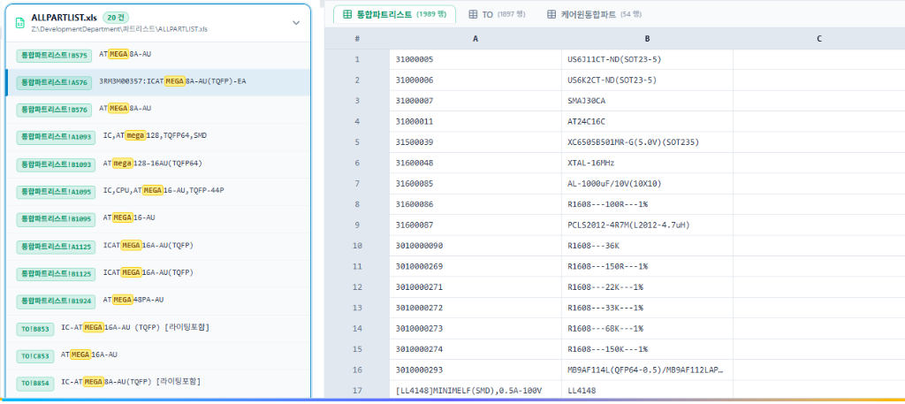

<div align="center">


# FlashText Search (极速文本与文档搜索)

**Ultra-Fast Text & Spreadsheet Content Search Desktop Application for Windows**  
**Windows 极速全文与 Excel 深度内容检索桌面应用**  
**Windows 초고속 전문(Full-Text) 및 Excel 스프레드시트 콘텐츠 검색 데스크톱 앱**

[](https://opensource.org/licenses/MIT)
[](https://github.com/KwangYeonCHO/FlashTextSearch/releases)
[](https://github.com/KwangYeonCHO/FlashTextSearch)
[](https://tauri.app/)
[](https://www.rust-lang.org/)
[](https://vuejs.org/)

[🇨🇳 简体中文](#-简体中文) • [🇰🇷 한국어](#-한국어) • [🇺🇸 English](#-english)

---



</div>

---

## 🇨🇳 简体中文

### 📖 项目简介
**FlashText Search** 是一款专为 Windows 用户打造的极速全文与文档内容搜索桌面应用。
后端采用 **Rust** 原生编写，结合 **零拷贝内存映射 (memmap2)**、**Aho-Corasick SIMD 向量化算法** 与 **多线程并发调度 (Rayon)**，可在数秒内穿透数十万级纯文本、源代码以及各类 Excel 表格文件。

前端采用现代化 **Vue 3 + TypeScript + Tailwind CSS**，深度集成了 **Monaco Editor (VS Code 核心编辑器)** 与高性能 **Excel 电子表格矩阵视图**，提供流畅平滑的行号精确定位、单元格高亮、历史记录记忆与 GitHub 在线自动更新能力。

---

### ✨ 核心特性

1. **⚡ 极致多线程检索性能**
   - 纯文本与源码：基于 `memmap2` 零拷贝与 `aho-corasick` SIMD 指令集检索，吞吐速度高达每秒数万文件。
   - Excel 电子表格：原生集成 `calamine` 高速引擎，穿透扫描 `.xlsx`, `.xls`, `.ods`, `.xlsb` 全工作表。
   - 智能编码识别：自动探测 UTF-8, GBK, GB18030, EUC-KR, UTF-16LE/BE 等多国编码，彻底避免乱码。

2. **📊 Excel 表格与代码行精准定位**
   - 搜索命中即时提取工作表名称与单元格坐标（如 `통합파트리스트!A576`）。
   - 点击搜索结果，右侧沉浸式预览自动滚动并居中高亮选中单元格或代码行。
   - 支持多达 50,000 行超大表格与代码文档的极速预览与渲染。

3. **💾 搜索条件持久化与智能历史管理**
   - 自动记忆上次搜索的根目录路径与检索关键词，启动即恢复。
   - 历史记录下拉面板稳定展示，点击/失焦自动判断，绝无闪退。
   - 支持对单条历史记录进行快捷删除 (`✕`)，亦支持一键全部清空。

4. **🔄 GitHub 在线全自动更新**
   - 程序内置自动更新检查服务，直接拉取 GitHub 官方最新 Release。
   - 支持一键全自动下载、进程热替换与平滑重启。

5. **🎨 四大视觉主题与三语国际化**
   - **视觉主题**：🌌 极夜暗影 (Dark Slate)、🌊 深海星夜 (Midnight Navy)、🪙 黑曜金奢 (Obsidian Gold)、☀️ 晨曦素雅 (Light Crisp)。
   - **多语言**：🇨🇳 简体中文、🇰🇷 한국어、🇺🇸 English 实时热切换。

---

### ⌨️ 快捷键指南

| 快捷键 | 功能说明 |
| :--- | :--- |
| `Enter` | 聚焦输入框时快速发起搜索 |
| `Escape` | 关闭搜索历史下拉面板 |
| `F3` | 跳转到当前文档的下一个匹配项 (Next) |
| `Shift + F3` | 跳转到当前文档的上一个匹配项 (Prev) |

---

### 📥 快速下载与运行

直接前往 [Releases 页面](https://github.com/KwangYeonCHO/FlashTextSearch/releases) 下载最新的 `FlashTextSearch.exe`，无需安装任何环境，双击即可直接运行。

---

## 🇰🇷 한국어

### 📖 프로젝트 소개
**FlashText Search**는 Windows 사용자를 위해 개발된 초고속 전문(Full-Text) 및 문서 콘텐츠 검색 데스크톱 애플리케이션입니다.
백엔드는 **Rust**로 구현되어 **제로카피 메모리 매핑(memmap2)**, **Aho-Corasick SIMD 벡터화 알고리즘**, **Rayon 멀티스레드 병렬 처리**를 통해 수십만 개의 텍스트 파일, 소스 코드 및 Excel 문서를 단 몇 초 만에 고속으로 스캔합니다.

프론트엔드는 **Vue 3 + TypeScript + Tailwind CSS** 기반으로 제작되었으며, **Monaco Editor(VS Code 에디터 코어)** 및 고성능 **Excel 시트 뷰어**를 내장하여 일치하는 줄 번호와 셀 좌표로의 자동 부드러운 스크롤, 일치 셀 강조, 검색어/경로 히스토리 기억 및 GitHub 자동 업데이트를 완벽히 지원합니다.

---

### ✨ 주요 기능

1. **⚡ 극한의 멀티스레드 검색 성능**
   - 텍스트 및 소스 코드: `memmap2` 제로카피 및 `aho-corasick` SIMD 가속으로 초당 수만 파일 고속 스캔.
   - Excel 문서: `calamine` 고속 엔진 내장으로 `.xlsx`, `.xls`, `.ods`, `.xlsb` 모든 워크시트 및 셀 내용 완벽 탐색.
   - 다국어 인코딩 자동 감지: UTF-8, EUC-KR, CP949, GBK, UTF-16 등을 자동 인식하여 글자 깨짐 방지.

2. **📊 Excel 셀 및 소스 코드 행 정밀 위치 이동**
   - 검색 일치 항목의 시트명과 셀 좌표(예: `TO!B853`, `통합파트리스트!A576`) 자동 추출.
   - 검색 결과 클릭 시 오른쪽 미리보기 패널에서 해당 행과 셀로 즉시 자동 스크롤 및 펄스 하이라이트.
   - 최대 50,000행에 달하는 대용량 시트 및 소스 파일도 끊김 없이 부드럽게 탐색 가능.

3. **💾 검색 경로/키워드 히스토리 및 개별 삭제**
   - 최근 검색한 폴더 경로 및 검색어를 로컬에 자동 보관하여 재실행 시 즉시 복원.
   - 검색어 입력창 클릭 시 히스토리 드롭다운 제공, 개별 삭제(`✕`) 및 전체 삭제 지원.

4. **🔄 GitHub 최신 릴리스 자동 업데이트**
   - GitHub Releases를 통한 버전 자동 확인.
   - 원클릭 자동 다운로드, 프로세스 교체 및 재시작 지원.

5. **🎨 4가지 테마 및 3개 국어 지원**
   - **테마**: 다크 슬레이트, 미드나잇 네이비, 옵시디언 골드, 라이트 크리스프 (화이트 모드).
   - **언어**: 한국어 🇰🇷, 중국어 🇨🇳, 영어 🇺🇸 실시간 변경 지원.

---

### 📥 다운로드 및 실행 방법

[Releases 페이지](https://github.com/KwangYeonCHO/FlashTextSearch/releases)에서 최신 `FlashTextSearch.exe`를 다운로드하여 별도 설치 없이 바로 실행하실 수 있습니다.

---

## 🇺🇸 English

### 📖 Overview
**FlashText Search** is an ultra-fast desktop application designed for Windows power users to search text and spreadsheet contents at lightning speed.
Built with **Rust** on the backend using **Zero-Copy Memory Mapping (`memmap2`)**, **Aho-Corasick SIMD Vector Acceleration**, and **Rayon multi-threaded scheduling**, it traverses hundreds of thousands of documents and Excel spreadsheets within seconds.

The frontend is powered by **Vue 3, TypeScript, and Tailwind CSS**, featuring an integrated **Monaco Editor** and high-performance **Excel Worksheet Matrix Viewer** with smooth scrolling to matched coordinates, custom themes, persistent search history, and seamless GitHub in-app updates.

---

### ✨ Key Features

1. **⚡ Extreme Multi-Threaded Search Engine**
   - Plain text & code files: Zero-copy memory mapping (`memmap2`) + SIMD acceleration (`aho-corasick`).
   - Excel Spreadsheets: Native `.xlsx`, `.xls`, `.ods`, and `.xlsb` parsing via `calamine`.
   - Multi-Encoding Detection: Intelligent auto-detection for UTF-8, UTF-16, EUC-KR, GBK, and ASCII.

2. **📊 Deep Coordinate Jumping & Cell Highlighting**
   - Automatically extracts sheet names and cell coordinates (e.g. `Sheet1!A576`).
   - Clicking a search result smoothly scrolls to and pulses the target row/cell in the preview pane.
   - Supports previewing and scrolling through up to 50,000 rows effortlessly.

3. **💾 Persistent Search History with Individual Deletion**
   - Remembers recent search paths and keywords across application restarts.
   - Dropdown history panel with single-item deletion (`✕`) and clear-all functionality.

4. **🔄 Automated GitHub Releases Updater**
   - Directly checks and fetches updates from official GitHub Releases.
   - One-click automatic download, binary hot-swap, and restart.

5. **🎨 4 Modern Themes & Tri-lingual Localization**
   - **Themes**: Dark Slate, Midnight Navy, Obsidian Gold, Light Crisp.
   - **Languages**: 🇨🇳 Simplified Chinese, 🇰🇷 Korean, 🇺🇸 English.

---

### ⌨️ Keybindings

| Shortcut | Description |
| :--- | :--- |
| `Enter` | Launch fast search |
| `Escape` | Dismiss history dropdown |
| `F3` | Jump to next matched item |
| `Shift + F3` | Jump to previous matched item |

---

### 🛠️ Development & Building from Source

```bash
# 1. Clone repository
git clone https://github.com/KwangYeonCHO/FlashTextSearch.git
cd FlashTextSearch

# 2. Install frontend dependencies
npm install

# 3. Run in development mode
npm run tauri dev

# 4. Build standalone Windows executable
npm run tauri build -- --no-bundle
```

---

## 📄 License

This project is open source and available under the terms of the [MIT License](LICENSE).

Copyright (c) 2026 KwangYeon CHO.
